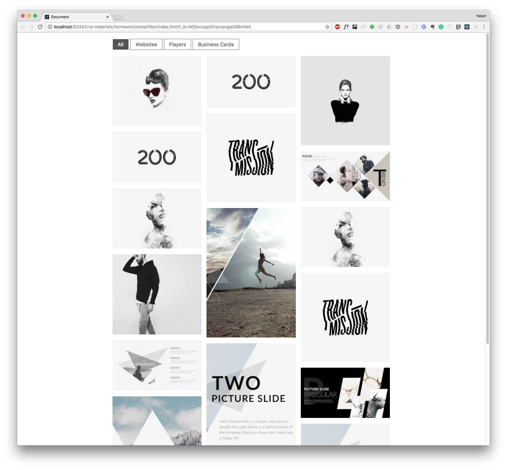

Портфолио с фильтрами
===

Необходимо реализовать портфолио с фильтрами, аналогичное указанному на изображении.




## Описание проекта

Разработайте компонент класса `Portfolio`, хранящий список фильтров, активный фильтр, а также список проектов.


Набор данных для отображения:
```js
[{
  img: "https://raw.githubusercontent.com/netology-code/ra16-homeworks/master/events-state/filter/img/mon.jpg",
  category: "Business Cards"
}, {
  img: "https://raw.githubusercontent.com/netology-code/ra16-homeworks/master/events-state/filter/img/200.jpg",
  category: "Websites"
}, {
  img: "https://raw.githubusercontent.com/netology-code/ra16-homeworks/master/events-state/filter/img/emi_haze.jpg",
  category: "Websites"
}, {
  img: "https://raw.githubusercontent.com/netology-code/ra16-homeworks/master/events-state/filter/img/codystretch.jpg",
  category: "Websites"
}, {
  img: "https://raw.githubusercontent.com/netology-code/ra16-homeworks/master/events-state/filter/img/Triangle_003.jpg",
  category: "Business Cards"
}, {
  img: "https://raw.githubusercontent.com/netology-code/ra16-homeworks/master/events-state/filter/img/place200x290.png",
  category: "Websites"
}, {
  img: "https://raw.githubusercontent.com/netology-code/ra16-homeworks/master/events-state/filter/img/200.jpg",
  category: "Websites"
}, {
  img: "https://raw.githubusercontent.com/netology-code/ra16-homeworks/master/events-state/filter/img/transmission.jpg",
  category: "Business Cards"
}, {
  img: "https://raw.githubusercontent.com/netology-code/ra16-homeworks/master/events-state/filter/img/place200x290_1.png",
  category: "Websites"
}, {
  img: "https://raw.githubusercontent.com/netology-code/ra16-homeworks/master/events-state/filter/img/place200x290_2.png",
  category: "Flayers"
}, {
  img: "https://raw.githubusercontent.com/netology-code/ra16-homeworks/master/events-state/filter/img/the_ninetys_brand.jpg",
  category: "Websites"
}, {
  img: "https://raw.githubusercontent.com/netology-code/ra16-homeworks/master/events-state/filter/img/dia.jpg",
  category: "Business Cards"
}, {
  img: "https://raw.githubusercontent.com/netology-code/ra16-homeworks/master/events-state/filter/img/Triangle_350x197.jpg",
  category: "Websites"
}, {
  img: "https://raw.githubusercontent.com/netology-code/ra16-homeworks/master/events-state/filter/img/emi_haze.jpg",
  category: "Websites"
}, {
  img: "https://raw.githubusercontent.com/netology-code/ra16-homeworks/master/events-state/filter/img/transmission.jpg",
  category: "Business Cards"
}, {
  img: "https://raw.githubusercontent.com/netology-code/ra16-homeworks/master/events-state/filter/img/Triangle_350x197_1.jpg",
  category: "Websites"
}, {
  img: "https://raw.githubusercontent.com/netology-code/ra16-homeworks/master/events-state/filter/img/place200x290_3.png",
  category: "Flayers"
}]
```
